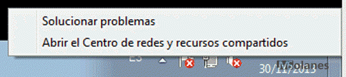
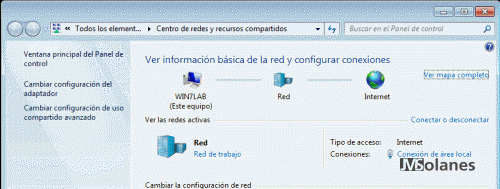
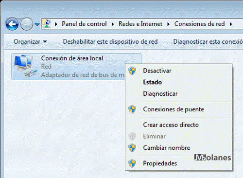
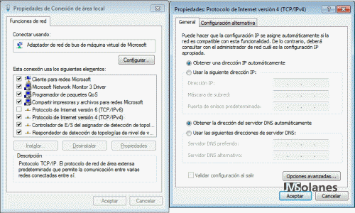
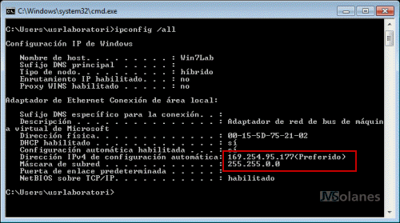
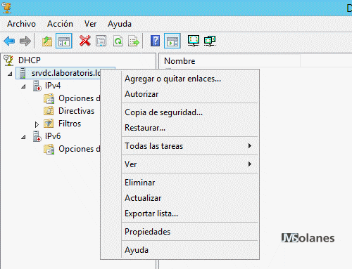
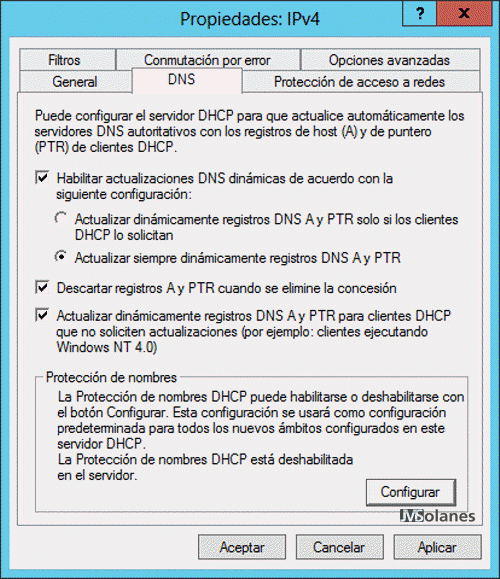
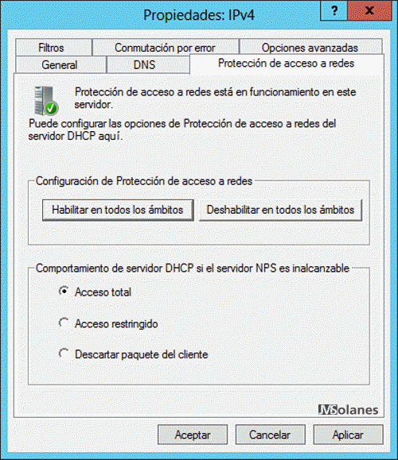

# DHCP : Configuració Dinàmica de Sistemes

### Índex de Contingut
- [El servei DHCP](#punt1)
- [El protocol DHCP i els seus components](#punt2)
- [Instal·lació d'un servei DHCP](#punt3)
  - [Instal·lació del servei DHCP a Ubuntu Serves](#punt3.1)
  - [Instal·lació del servei DHCP a Windows](#punt3.2)
- [Recursos DHCP](#punt4)

## El servei DHCP 
DHCP és l’acrònim de dynamic host configuration protocol, en català, protocol de configuració dinàmica d’equips. 

#### Què fa el DHCP?

Una forma planera d’entendre el DHCP és imaginar que els equips de client en arrencar fan un crit per la xarxa i pregunten “que hi ha algú?”, “qui sóc jo?”. El servidor de DHCP els contesta proporcionant-los tota la informació necessària perquè sàpiguen qui són i com han de configurar els seus paràmetres de xarxa.

#### Identificació dels equips de xarxa
Tot equip de xarxa necessita disposar: 
- Una adreça IP que l’identifica de manera única a la xarxa. 
- Una màscara per poder separar de l’adreça IP quina és la part d’adreça de xarxa i quina la part d’adreça de host.
- Una adreça de la porta d’enllaç predeterminada o passarel·la per defecte (o gateway), per disposar d’accés a xarxes externes.
- Adreces dels servidors DNS a consultar.

El servei DHCP simplifica l’administració de la configuració dels equips de xarxa fent-la centralitzada, dinàmica i amb concessions per períodes de temps finits. 
Els principals avantatges d’utilitzar DHCP són: 
- Evitar conflictes d’adreces IP
- Estalviar temps i de feina. 

#### Configuració d'un equip de xarxa
Les opcions de configuració de xarxa es poden assignar a cada equip estàticament o es poden configurar de manera dinàmica utilitzant DHCP. 

#### Tipus d'assignacions d'adreces IP

Quan l’adreça IP i els altres paràmetres necessaris de configuració de la xarxa es configuren equip per equip, manualment, es diu que tenen **IP estàtica**. 

Quan la configuració de xarxa d’un equip es rep per mitjà d’un servidor DHCP es diu que utilitza una adreça **IP dinàmica**. Aquesta adreça pot variar dins d’un interval d’adreces disponibles per al servidor DHCP o pot ser fixa. 

## El protocol DHCP i els seus components
Tot protocol implica un diàleg entre els equips que hi intervenen, ens caldrà doncs analitzar quin és i com es produeix aquest diàleg. Finalment es descriurà el significat de termes tan usuals en DHCP com intervals, exclusions, concessions i reserves. 

El protocol DHCP està basat en l’arquitectura de serveis **client-servidor** i utilitza com a transport el **protocol UDP** de la pila de protocols TCP/ IP. El servidor DHCP es comunica amb els clients utilitzant paquets UDP, que rep en el seu **port 67** i envia al **port 68 del client**. 

#### El model funcional del protocol DHCP
 El protocol DHCP descriu el diàleg que es produeix entre client i servidor per a la concessió de configuracions IP. En una xarxa amb configuració d’equips dinàmica, **un o més servidors DHCP escoltaran les peticions dels clients en el port 67**. Els clients DHCP sol·licitaran al servidor DHCP una **configuració IP**, i començarà un procés de **negociació** que ha d’acabar (si tot va bé) amb la concessió d’una adreça IP al client. **Els servidors parlen al port 68 dels clients**.

La negociació que s’estableix es pot definir a grans trets de la manera següent:

- El client sol·licita una adreça IP (de fet, una configuració de xarxa).
- El servidor mira les adreces IP disponibles dins de l’**interval d’adreces dinàmiques** de què disposa per concedir i n’ofereix una al client.
- Si el client l’accepta, envia una sol·licitud al servidor per fer-la seva.
- Si al servidor li sembla bé, accepta la petició del client i li confirma que pot utilitzar aquesta IP, que la hi concedeix per un **període de temps limitat**.

Transcorregut el període de lloguer, el client haurà de **renegociar** la concessió en un procés similar al descrit anteriorment.

<image src="https://ioc.xtec.cat/materials/FP/Recursos/fp_smx_m07_/web/fp_smx_m07_htmlindex/WebContent/u1/media/smxm7uf1ud1_im1.png" width=200 />

Els següents són els tipus de paquets DHCP:
- **DHCP discover**: L’envia el client per tal de demanar una configuració IP a algun servidor. El client no sap a quina xarxa pertany (no té adreça IP ni màscara de xarxa) i tampoc sap quins servidors DHCP hi ha en la xarxa (si n’hi ha cap), per tant, genera un paquet de difusió (broadcast).
- **DHCP offer**: Un servidor DHCP mira d’atendre les peticions dels clients proporcionant una IP de l’interval d’adreces dinàmiques que gestiona **(pool)**. Ha de mirar quines de les adreces li queden lliures i un cop assignada ho anota en un fitxer de registre de les concessions efectuades. Cada vegada que finalitza una **concessió (lease)**, i en cas de no ser renovada, el servidor pot tornar a utilitzar la IP per a un altre client. A un determinat client se li pot assignar una **IP concreta** a partir de la seva MAC, si aquesta relació està establerta al servidor. El servidor selecciona una IP disponible i la **reserva** per al client (encara no està assignada). Tot seguit envia un paquet **DHCP offer (unicast)** al client amb tota la informació de configuració requerida.
- **DHCP request**: Quan el client rep una oferta de configuració IP per part d’un servidor, la pot acceptar o rebutjar. Si el client no accepta l’oferta, simplement realitzarà un **DHCP discovery** de nou. Això és suficient perquè el servidor s’adoni que l’oferta ha estat rebutjada. Si el client accepta l’oferta, ho ha de comunicar al servidor. El mecanisme per fer-ho és mitjançant un paquet **DHCP request** enviat un altre cop per difusió fent públic a la xarxa que ha acceptat una oferta. A hores d’ara, el client encara no disposa de l’adreça IP per utilitzar-la.
- **DHCP ack/nack**: L’últim pas en una negociació DHCP bàsica el realitza el servidor quan finalment autoritza la concessió enviant el paquet **DHCPACK** (DHCP akcnowledgement, paquet unidestinació adreçat a la MAC del client). A partir d’aquest moment, el client sí pot fer ús de l’adreça IP i de la configuració de xarxa rebuda. DHCPACK inclou tota la informació referent a la durada de la concessió i les dades necessàries per gestionar quan expira. El servidor anotarà en el registre de concessions la que acaba de realitzar i detallarà tots els aspectes d’aquesta. Quan un servidor DHCP detecta que la IP que havia reservat per a un client i que li anava a concedir ja està en ús, el servidor envia al client un paquet **DHCPNACK** i indica la no-autorització de la concessió.
- **DHCP decline**: El client també pot examinar l’adreça IP oferta pel servidor per comprovar si està en ús o no. Pot fer altres proves per veure si li sembla correcta o no l’oferta rebuda del servidor. El client pot enviar un paquet DHCP decline al servidor per indicar que la seva oferta ha estat rebutjada.
- **DHCP release**: Quan un client ja no necessita més l’ús de la configuració IP que ha rebut, la pot alliberar enviant al servidor un paquet **DHCP release**. En fer-ho, el servidor afegeix l’adreça IP al conjunt d’adreces dinàmiques que té disponiblesi fa l’anotació pertinent en el registre de concessions (leases) per indicar que ha finalitzat l’ús de l’adreça.
- **DHCP information**: En tot moment el client pot sol·licitar més informació sobre la configuració de xarxa al servidor utilitzant un paquet DHCP information. En el paquet DHCP offer que el servidor envia al client, consten les informacions generals de configuració de xarxa que es trameten en l’oferta: adreça IP, màscara de xarxa, porta d’enllaç predeterminada, servidor DNS, fitxer a baixar i molts altres paràmetres que poden estar configurats per enviar-se en l’oferta.
- **Renovació d'una IP concreta**: El client pot demanar continuar usant la mateixa IP amb un paquet DHCP request, i el servidor li pot concedir amb el paquet DHCP ACK. Si el servidor no li pot concedir (està en ús, no és de l’interval que gestiona, etc.) envia un DHCP NACK. 

#### Intervals, exclusions, concessions i reserves
Descrivim ara alguns dels aspectes més importants que formen part de la configuració DHCP.

- **Interval**: conjunt d’adreces dinàmiques que el servidor té disponibles per assignar als clients. S’agrupen per oferir-se a les diverses subxarxes que atén el servidor. Una mateixa subxarxa pot disposar de diversos intervals.
~~~
subnet 140.220.191.0 netmask 255.255.255.0 {
 range 140.220.191.150 140.220.191.249;
}
subnet 239.252.197.0 netmask 255.255.255.0 {
 range 239.252.197.10 239.252.197.107;
 range 239.252.197.113 239.252.197.250;
}
~~~
 - **Exclusions**: adreces IP que no s’ofereixen dinàmicament per part del servidor. És a dir, que no formen part de cap interval.
 - **Concessions**: l’assignació d’una adreça IP i la resta de paràmetres de xarxa a un client és una concessió (o leasse). Els clients reben les concessions per períodes de temps finits, que en finalitzar, cal renegociar. Tant el client com el servidor s’anoten les concessions.
- **Reserves**: anomenem reserves aquelles adreces IP que s’assignen via DHCP però de manera fixa, normalment a un equip amb una MAC o nom de host concret. 
~~~
subnet 140.220.191.0 netmask 255.255.255.0 {
 host server {
  hardware ethernet 08:00:2b:4c:59:23;
  fixed-address 140.220.191.1;
 }
 range 140.220.191.150 140.220.191.249;
 }
~~~
## Instal·lació d'un servei DHCP 
El servei de xarxa DHCP està estructurat en forma de servei client/servidor; per tant, caldrà disposar del programari apropiat per fer cada un d’aquests rols. El programari que fa la funció de client usualment ja està integrat en el sistema operatiu (la part que gestiona la xarxa). Així doncs, quan parlem d’instal·lar un servei DHCP fem referència al procés d’instal·lació i configuració del programari del servidor DHCP. Evidentment també caldrà configurar els clients adequadament per fer ús d’aquest servei. 

### Instal·lació del servei DHCP a Ubuntu Server (isc-dhcp-server)
Tot i que aquest servei DHCP ha deixat d'estar mantingut per ISC en favor de KEA, continua sent avui dia el mes implantat en sistemes Linux. 
- [Pàgina oficial ISC DHCP](https://www.isc.org/dhcp/)
- [Manual ISC DHCP 4.4](https://kb.isc.org/docs/isc-dhcp-44-manual-pages-dhcpd)

En primer lloc executem un update per obtenir els últims cadidats del paquet, posteriorment instal·lem el sercei i en comprovem l'estat (evidentment estarà caigut ja que encara no ha estat configurat):
~~~
# apt update
# apt install isc-dhcp-server
# systemcltl status isc-dhcp-server    
~~~
Iniciem la configuració del servei indicant quines interfícies s'utilitzaran per escoltar les peticions dels clients, al fitxer **`/etc/default/isc-dhcp-server`**:
~~~
# nano /etc/default/isc-dhcp-server
 ...
 INTERFACESv4=”enp0s….”
 ...
~~~
Realitzem una configuració bàsica del servei al fixer **`/etc/dhcp/dhcpd.conf`**:
~~~
option domain-name "example.local";
option domain-name-servers 8.8.8.8;
default-lease-time 3600;
max-lease-time 86400;
ddns-update-style none;
subnet 192.168.56.0 netmask 255.255.255.0 {
       range 192.168.56.220 192.168.56.240;
       option routers 192.168.56.10;
}
~~~
Provem ara a iniciar el servei i comprovar el seu funcionament des d'un client de la xarxa. 
Aquesta comprovació la podem realitzar des del client:
- Configurem la xarxa per tal de rebre la informació necessaria de forma automàtica (DHCP).
- Podem forçar l'alliberament d'una adreça ja asignada prèviament amb la comanda **`sudo dhclient -r -v`**
- Podem sol·licitar una nova adreça amb la comanda **`sudo dhclient -v`**

En cas de no aconseguir-ho podem comprovar els possibles errors amb la comanda **journalctl -xe**

I també podem comprovar des del servidor:
- Que la negociació s'ha realitzat correctament observant el log del servidor a **`/var/log/syslog`**
- Que el registre de la concessió ha estat creat al fitxer de concessions **`/var/lib/dhcp/dhcpd.leases`**

#### Configuració de reserves
En el següent codi configurem dos pools d'adreces, un per a clients coneguts i un altre per la resta. Afegim clients coneguts amb la directiva **`host`** declarant la seva MAC.
~~~
subnet 192.168.56.0 netmask 255.255.255.0 {
        option routers 192.168.56.10;
        pool{
                range 192.168.56.220 192.168.56.240
                allow known-clients;
                deny unknown-clients;
        }
        pool{
                range 192.168.56.100 192.168.56.120;
                allow unknown-clients;
        }

        host clientUbuntu{
                hardware ethernet 08:00:27:1B:17:6b;
                #fixed-address 192.168.56.250;
        }
        host client2{hardware ethernet 11:22:33:44:55:66}
}
~~~

#### Habilitant l'encaminament a Ubuntu Server
Per tal que els nostres clients puguin sortir a internet a través del nostre servidor (que farà de porta d'enllaç) hem de realitzar dues configuracions adicionals.
- Habilitar el forwarding des del fitxer **`/etc/sysctl.conf`** descomentant la següent línia i fent un **reboot** al servidor:
  
   `net.ipv4.ip_forward=1`
  
- Afegir una regla NAT d'enmascarament als paquets que surtin cap a internet:
  
   `# sudo iptables -t nat -A POSTROUTING -o enp0s3 -j MASQUERADE`
  
Podem comprovar que aquesta regla s'ha afegit correctament amb la comanda:
~~~
# sudo iptables -t nat -L
~~~
Per aconseguir que aquestes regles no desapareixin al reiniciar el servidor instal·lem una eina que aconseguirà que siguin persistents:
~~~
# sudo apt install iptables-persistent
~~~
La regla es guardarà a: **`/etc/iptables/rules.v`**
En cas d'afegir més regles posteriorment i voler desar-les també com a persistents, podem executar la comanda:
~~~
# sudo su
# iptables-save > /etc/iptables/rules.v4
~~~
### Instal·lació del servei DHCP a Windows 

Per instal·lar el rol del servidor DHCP des de l'Administrador del Servidor, en l'arbre de característiques buscarem DHCP i el marcarem, afegint les característiques requerides.
Un cop instal·lat se'ns ofereix la possibilitat de completar la configuració bàsica del servei, durant aquest breu procés es crearan els grups de seguretat necessaris per gestionar el servei. En acbar reiniciarem el servei per aplicar els canvis.

Ara ja som en condicions de crear el nostre primer àmbit. ho farem des de **Inici>Eines Administratives>DHCP** on escollirem l'opció **Nou Àmbit** que apareixerà en fer botó dret sobre IPv4. A partir d'aquí podem definir una sèrie d'opcions com:
- Nom i descripció de l'àmbit.
- Rang d'adreces de concessió i la seva màscara.
- Rang d'exclusions.
- Durada de la concessió.
- Altres opcions DHCP com:
  - Porta d'enllaç.
  - Nom de domini i servidors DNS.
  - Servidors WINS.
  
Un cop configurades les opcions ja només ens quedarà activar l'àmbit i comprovar que el servei està actiu.

#### Habilitant l'encaminament a Windows Server
Abans de començar ens hem d'assegurar de que les interfaces del server estan correctament configurades. Un cop realitzades les comprovacions anidrem a l'administrador del servidor per tal d'afegir un nou rol l'**Accés Remot**.
En la pantalla de selecció de reveis del Rol, escollim **Routing** (comprovarem com d'afegeix automàticament l'accés directe i VPN, que més endavant utilitzarem) i seguim, deixem per defecte els serveis proposats per al Servidor WEB i procedim a instal·lar.

Un cop instal·lat, el servei ja apareixera en el menú d'eines, el seleccionem i un cop accedim a la pantalla de configuració fem botó dret sobre el servidor i procedim a **Configurar i Habilitar el Servei**. Durant el procés d'instal·lació escollirem les opcions:
- Traducció d'adreces de Xarxa (NAT). Aquest és el nostre objectiu, ja que pretenem encaminar paquets des de les nostres xarxes internes cap a Internet.
- En la següent pantalla només ens queda seleccionar la interfície de sortida i finalitzar la configuració.

Ja només ens queda comprovar que els nostres clients poden connectar amb xarxes remotes.

#### Instruccions detallades per a la instal·lació

En cada segment de xarxa només hi pot haver un sol server de DHCP, per tant, abans de muntar-ne un s&#8217;ha d&#8217;assegurar que no n&#8217;existeix cap altre. Una de les incidències més comunes que em trobo és, precisament, que s&#8217;afegeix un router o Wi-Fi amb el servei aixecat donant adreces diferents i, com a conseqüència, assignant als equips xarxes diferents.

Una comprovació ràpida es pot fer posant un equip a la xarxa amb la configuració IP de la targeta de xarxa en mode automàtic. És com hauran d&#8217;estar configurats els equips que s&#8217;afegeixen a la xarxa i es vol que agafin adreça IP de manera automàtica.

Botó dret damunt la icona del costat del rellotge representada per un connector de xarxa, seleccionar <strong>Abrir el Centro de redes y recursos compartidos</strong>.

A la banda esquerra, seleccionar <strong>Cambiar configuración del adaptador</strong>.

Clicar damunt la targeta de xarxa amb el botó dret del ratolí i seleccionar <strong>Propiedades</strong>.

Marcar l&#8217;opció <strong>Protocolo de Internet versión 4 (TCP/IPv4)</strong>. Clicar el botó <strong>Propiedades</strong>. Es mostra el quadre de diàleg de la configuració TCP/IP, seleccionar, en els dos apartats (IP i DNS), <strong>Obtener una dirección IP automáticamente</strong>. Acceptar els quadres de diàleg que han quedat oberts.

Comprovem quina adreça IP té l&#8217;equip. Obrir una sessió de consola de sistema i executar la instrucció:

<pre>ipconfig /all</pre>

&nbsp;

Comprovar que l&#8217;adreça IP obtinguda és una adreça <strong>APIPA</strong> (Automatic Private IP Addressing), una adreça d&#8217;assignació automàtica, per quan no es troba un DHCP o no està configurada manualment l&#8217;adreça.

<ul>
<li>Les adreces APIPA IPv4 corresponen a una xarxa reservada de classe B i van des de la <strong>169.254.0.0</strong> fins a la <strong>169.254.255.255</strong>.</li>
<li>Les adreces APIPA IPv6 (link-local) són les que comencen i s&#8217;ubiquen a la xarxa<strong> FE80::/64</strong>.</li>
</ul>

Per tant, si el dispositiu té una adreça IPv4 que comença per 169.254.x.x, vol dir no s&#8217;ha trobat cap DHCP a la xarxa que li proporcionés una adreça IP. Aquest punt també va bé per diagnosticar problemes de peticions al DHCP, sobretot quan hi ha la xarxa segmentada amb VLANs i no es passen bé les peticions d&#8217;una VLAN a l&#8217;altre.

&nbsp;

Com s&#8217;instal·la un DHCP a la xarxa?

El DHCP és un servei que es pot instal·lar en els mateixos servidors que fan de controlador de Active Directory, o bé en servidors dedicats. Depèn de la mida de la xarxa i la criticitat dels serveis. Divideix i venceràs!

Per activar el rol o servei, cal anar a l&#8217;<strong>Administrador del servidor</strong>. Des de la pantalla principal, seleccionar <strong>Agregar roles y características</strong>.

Seleccionar<strong> Instalación basada en características o en roles</strong>. Clicar el botó <strong>Siguiente</strong>.

Seleccionar <strong>un servidor del grupo de servidores</strong>. Clicar el botó <strong>Siguiente</strong>.

De la llista desplegable, marcar <strong>Servidor DHCP</strong>. Al fer-ho, demana per afegir les característiques necessàries pel DHCP. Clicar el botó <strong>Agregar características, </strong>de nou a la pantalla de selecció, clicar el botó <strong>Siguiente</strong>.

Deixar les característiques marcades per defecte, clicar el botó <strong>Siguiente</strong>.

Informació del DHCP, bàsicament diu que s&#8217;ha de configurar un cop instal·lat. Clicar el botó <strong>Siguiente</strong>.

Resum de les accions a fer. Clicar el botó <strong>Instalar</strong>.

Acabada la instal·lació, clicar el botó <strong>Cerrar</strong>.

Ara tenim el servei instal·lat, però com que no està configurat, no és operatiu, no assigna adreces IP.

Com es configura un DHCP a la xarxa?

Des de l&#8217;<strong>Administrador del servidor</strong>, seleccionar <strong>DHCP</strong> (assistents) o bé obrir l&#8217;<strong>administrador de DHCP</strong> de les eines administratives. Personalment, no sóc massa amic dels assistents, pel que aniré directe al gra obrint directament l&#8217;administrador de DHCP.

Comencem configurant el propi servidor. Seleccionar el nom del servidor, botó dret &gt; <strong>Propiedades</strong>.

Assegurar la ruta de la base de dades de DHCP i la còpia de seguretat de la mateixa. Molt útil en cas de corrupció o haver de recuperar-la. A ser possible, una bona pràctica és ubicar els fitxers en discs separats. No obstant, en aquest cas al ser un únic servidor, només prenc nota de la ubicació i clicar el botó <strong>Aceptar</strong>.

Al tractar-se d&#8217;una instal·lació de xarxa amb un Active Directory, un punt clau és <strong>AUTORITZAR</strong> aquest servidor com DHCP. Però abans, fixar-se que a les opcions IPv4 i IPv6, al costat hi apareix un símbol de color vermell, indicant que no pot assignar adreces d&#8217;aquest tipus.

Botó dret damunt el nom del servidor, seleccionar <strong>Autorizar</strong>, sembla que no faci res, però si tornem a seleccionar el servidor amb el botó dret, ara surt la opció de NO autorizar. Si es reinicia el servei de DHCP, es pot observar que a les opcions IPv4 i IPv6 ara apareix al costat un símbol de color verd, indicant que pot assignar adreces d&#8217;aquest tipus.

&nbsp;

Després de reiniciar:

Botó dret damunt l&#8217;opció de <strong>IPv4</strong> i seleccionar <strong>Propiedades</strong>. Es mostra el quadre de diàleg de la configuració IPv4. Les opcions a configurar ja van una mica a gust del consumidor i les necessitats de la xarxa. Exposo les que normalment utilitzo.

<strong>Pestanya DNS. 
</strong>Seleccionar <strong>Actualitzar sempre dinàmicament registres DNS A i PTR;</strong> <strong>Descartar registres A i PTR quan s&#8217;elimini la concessió</strong> per no deixar brossa al DNS. I tot i que no hi hauria d&#8217;haver equips Windows NT tirant avall, si potser que hi hagi Linux, Mac&#8217;s, switchs, etc…que amb seguretat no es registraran, per això també selecciono <strong>Actualizar dinámicamente registros DNS A y PTR</strong>&#8230;.

<strong>Pestanya Protección de acceso a redes. 
</strong>De moment la deixem tal qual, quan parli del NAC o la protecció de xarxa ja tornarem a aquesta opció.

<strong>Pestanya Filtros.</strong> 
Llistes blanques i negres d&#8217;adreces MAC a les que assignar adreces IP. De moment no aplica.

<strong>Pestanya Conmutación por error.</strong> 
Permet posar el servei DHCP amb alta disponibilitat amb un altre servidor. De moment no aplica.

<strong>Pestanya Opciones avanzadas.</strong> 
Important! Clicant el botó <strong>Credenciales</strong>, indicar les credencials d&#8217;un usuari de Active Directory (jo utilitzo usrDHCP amb contrasenya forta) per fer el registre d&#8217;equips al DNS. Si no s&#8217;especifica, no es registraran i desregistraran les IPs del DHCP.

&nbsp;

<strong>*** Actualització 19 de gener 2016 ***</strong>

Hi ha un error de configuració en aquesta part que s&#8217;ha de completar amb l&#8217;entrada de <a href="/?p=8807">Zona de cerca inversa DNS amb DHCP.

<strong>******</strong>

&nbsp;

El botó <strong>Enlaces</strong>, en cas que el servidor tingui més d&#8217;una targeta de xarxa, permet especificar per quina targeta en concret ha d&#8217;operar el servei.

 
Clicar el botó <strong>Aceptar</strong>, quan tot sigui del vostre gust.

Seleccionar la carpeta <strong>Opciones de servidor</strong>, botó dret, seleccionar <strong>Configurar opciones</strong>.

Aquest apartat permet definir les opcions <strong>GENERALS </strong>per la xarxa, com per exemple, els servidors de DNS, el domini de DNS. Marcar les opcions:

<ul>
<li>Servidores de DNS. Afegir a la llista les adreces IP dels servidors DNS de la xarxa.</li>
<li>Nombre de dominio DNS. Indicar el nom FQDN, seguint l&#8217;exemple: laboratoris.local</li>
</ul>

Clicar el botó <strong>Aceptar</strong>.

&nbsp;

Crear àmbits d&#8217;adreces

Amb les opcions específiques definides, toca crear els àmbits d&#8217;adreces, és a dir, les diferents subxarxes que han d&#8217;assignar adreces IP. Aquí només se&#8217;n configura un, però en el cas de les VLANs, s&#8217;ha de definir un àmbit per cada una d&#8217;elles a les que es vol assignar adreces IP. Pels que teniu dubtes amb les VLANs, no s&#8217;ha de crear un servidor DHCP per a cada VLAN, sinó un sol servidor gestiona les IPs de totes les VLANs (indicant a l&#8217;encaminador els salts, és clar).

Botó dret damunt <strong>IPv4</strong>, seleccionar <strong>Ámbito nuevo</strong>. S&#8217;inicia l&#8217;assistent per la seva creació. Botó <strong>Siguiente</strong>.

Indicar el nom i la descripció de l&#8217;àmbit. Per exemple: Xarxa local (xarxa servidors, xarxa usuaris, xarxa industrials, etc&#8230;). Clicar el botó <strong>Siguiente</strong>.

Indicar IP inicial i final (ull, indicar IP de host, excloure l&#8217;ID de xarxa i broadcast) i la màscara. Clicar el botó <strong>Siguiente</strong>.

Rang d&#8217;adreces excloses, les que no es poden assignar automàticament. Reservar el rang d&#8217;adreces que s&#8217;assignen manualment, com poden ser els servidors, impressores, encaminadors, tallafocs, commutadors…Seguint l&#8217;exemple, afegeixo de la 192.168.0.1 a la 192.168.0.30 que és on posaré aquests dispositius. Clicar el botó <strong>Siguiente</strong>.

Temps de la concessió, és a dir, temps en que l&#8217;adreça IP estarà reservada per una MAC en concret. En les xarxes sense moviment d&#8217;equips es pot deixar a 8 dies. En xarxes Wi-Fi o que tenen molt de moviment d&#8217;equips (separat per VLANs, poden ser les zones de conferència, cafeteries, visites&#8230;) baixar el número a 2 o 4 hores, per no quedar-nos sense IPs.

<blockquote>
Recordar que per la pròpia arquitectura del DHCP, un client farà la petició de renovació quan arribi a la meitat del temps de concessió. Rebaixar inadequadament aquests temps pot implicar més tràfic i càrrega a la xarxa innecessari.
</blockquote>

Clicar el botó <strong>Siguiente</strong>.

L&#8217;assistent dóna la possibilitat de configurar les opcions específiques per l&#8217;àmbit, com pot ser la porta d&#8217;enllaç. Clicar el botó <strong>Siguiente</strong>.

Precisament aquesta és la primera opció, especificar la porta d&#8217;enllaç per la xarxa de l&#8217;àmbit. <strong>Cada àmbit tindrà una porta d&#8217;enllaç diferent</strong>, de la seva pròpia subxarxa. Indicar el que correspon, afegir-lo a la llista i clicar el botó <strong>Siguiente</strong>.

Pel servei de DNS, recupera la configuració de l&#8217;equip. Es pot deixar tal qual ja què prevaldran les opcions del servidor configurades anteriorment. Clicar el botó <strong>Siguiente</strong>.

Servei de WINS. No em digueu que encara teniu equips Windows 2000 o serveis NetBIOS a la xarxa? Doncs això, ho deixem en blanc. Clicar el botó <strong>Siguiente</strong>.

Es pot activar l&#8217;àmbit o deixar en pausa, útil per anar configurant sense modificar configuracions. En aquest cas <strong>toca activar-lo</strong>, clicar el botó <strong>Siguiente</strong>.

Ja s&#8217;ha acabat la configuració de l&#8217;àmbit, clicar botó <strong>Finalizar</strong>.

Repassant una mica les opcions que han quedat configurades en l&#8217;àmbit:

<strong>Conjunto de direcciones. 
</strong> Per poder excloure adreces IP de l&#8217;assignació automàtica. Es pot veure el rang que distribueix: 192.168.0.1 a 192.168.0.254 i un rang exclòs: 192.168.0.1 fins a 192.168.0.30.

<strong>Concesiones de direcciones.</strong> 
Les adreces que ha assignat el DHCP, a qui ho ha fet i quina duració. Com que encara ningú ha fet petició no en surt cap.

<strong>Reserves.</strong> 
Si es vol assignar una adreça IP sempre al mateix equip, en aquest apartat, s&#8217;especifica l&#8217;adreça MAC de l&#8217;equip i la IP que se li ha d&#8217;assignar. L&#8217;adreça IP no s&#8217;assignarà a ningú més, encara que l&#8217;equip no es connecti mai.

&nbsp;

<strong>Opcions d&#8217;àmbit.</strong> 
Les opcions específiques per l&#8217;àmbit (l&#8217;encaminador). L&#8217;assistent ha afegit els servidors DNS i nom de domini DNS, com que ja s&#8217;han definit en les opcions de servidor, els eliminem per no crear confusió.

<strong>Directivas.</strong> 
Permet assignar opcions específiques (opció de NTP per telèfons de veu IP, per exemple) segons l&#8217;identificador o característiques del dispositiu. No acostumo a utilitzar aquest apartat.

Arribats a aquest punt, ja tenim un servidor de DHCP operatiu a la xarxa!

## Recursos DHCP
- [Tutorial del servei DHCP a FPGenred](https://www.fpgenred.es/DHCP/index.html)
- [Material DHCP al ioc](https://ioc.xtec.cat/materials/FP/Recursos/fp_smx_m07_/web/fp_smx_m07_htmlindex/WebContent/u1/a1/continguts.html)
- [Pàgina oficial ISC DHCP](https://www.isc.org/dhcp/)
- [Manual ISC DHCP 4.4](https://kb.isc.org/docs/isc-dhcp-44-manual-pages-dhcpd)
- [Habilitar encaminament a Windows Server 2022](https://witcherit.com/2020/09/20/instalar-servicio-de-enrutamiento-en-windows-server-2019/)
  
